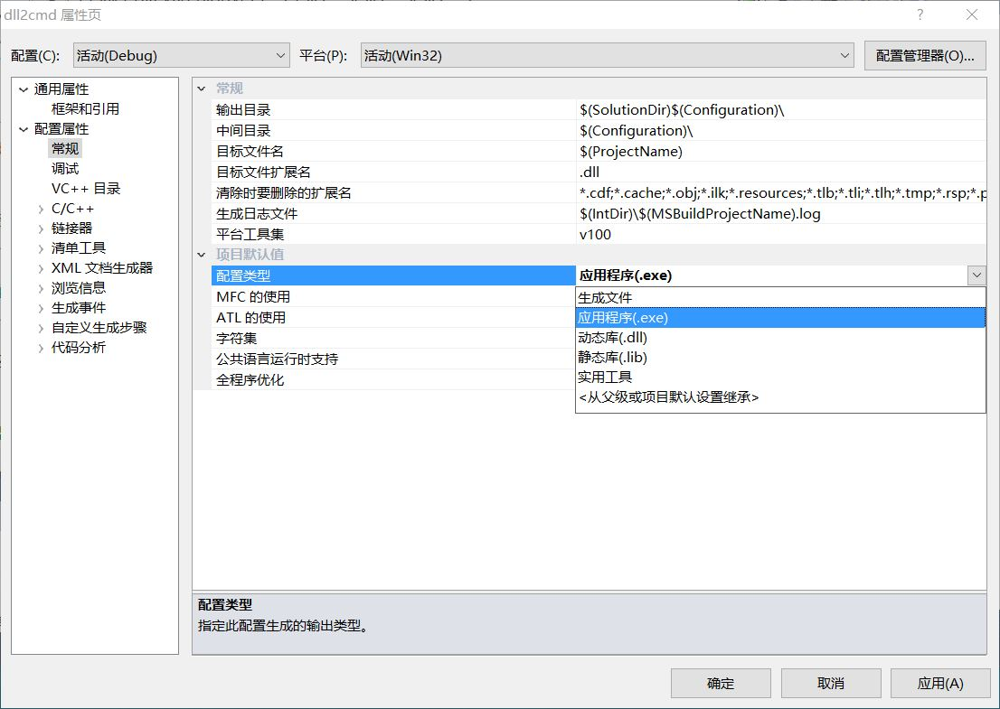
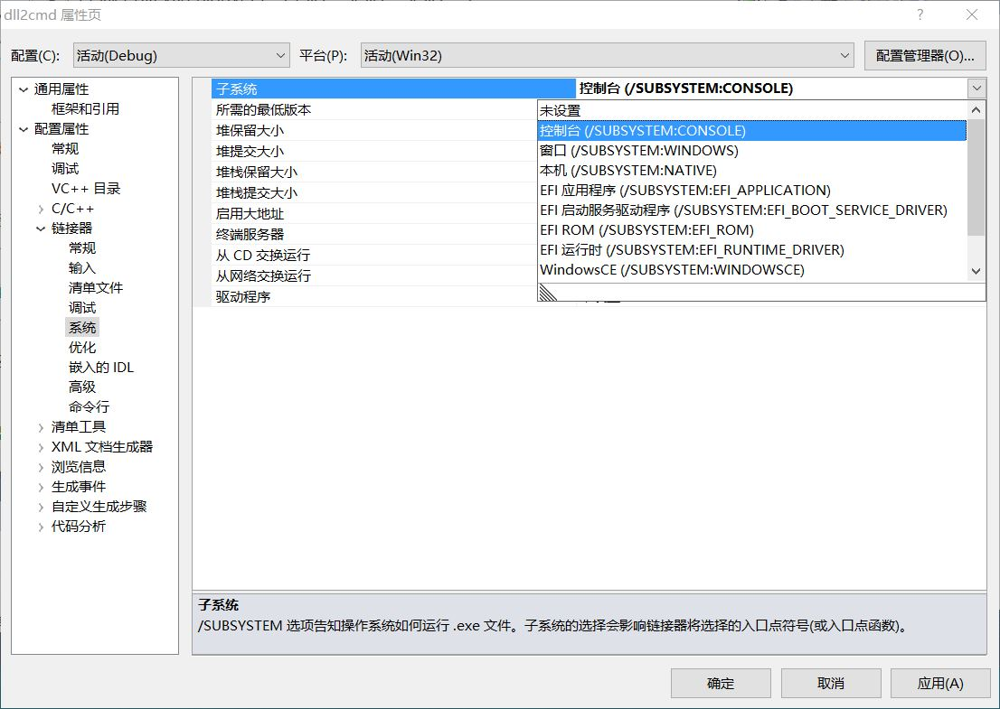
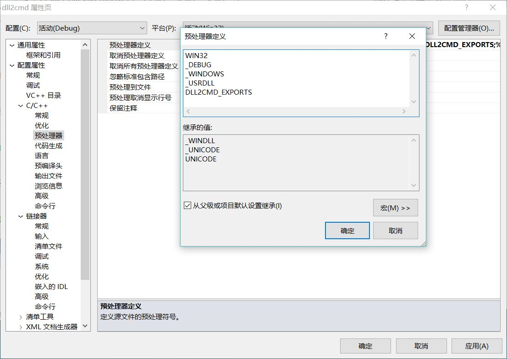
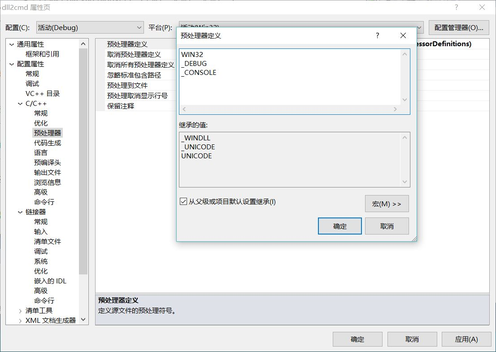
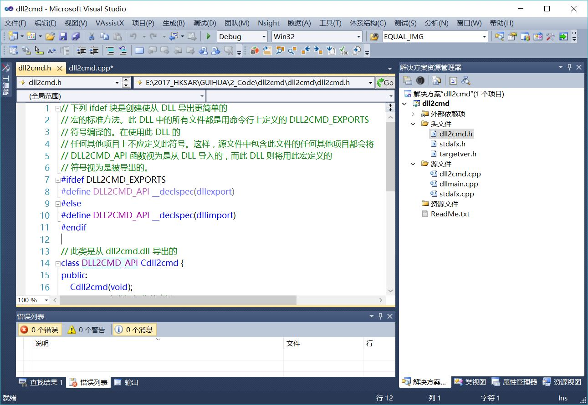

1.将配置类型改为【应用程序】。



2.将【窗口】改为【控制台】



3.修改预处理器定义



改为第二步对应的_CONSOLE



4.删除对应的接口DLL函数，添加main函数。



5.可移除dllmain.cpp

```cpp
// dllmain.cpp : 定义 DLL 应用程序的入口点。
#include "stdafx.h"

BOOL APIENTRY DllMain( HMODULE hModule,
                       DWORD  ul_reason_for_call,
                       LPVOID lpReserved
                     )
{
    switch (ul_reason_for_call)
    {
    case DLL_PROCESS_ATTACH:
    case DLL_THREAD_ATTACH:
    case DLL_THREAD_DETACH:
    case DLL_PROCESS_DETACH:
        break;
    }
    return TRUE;
}

```
