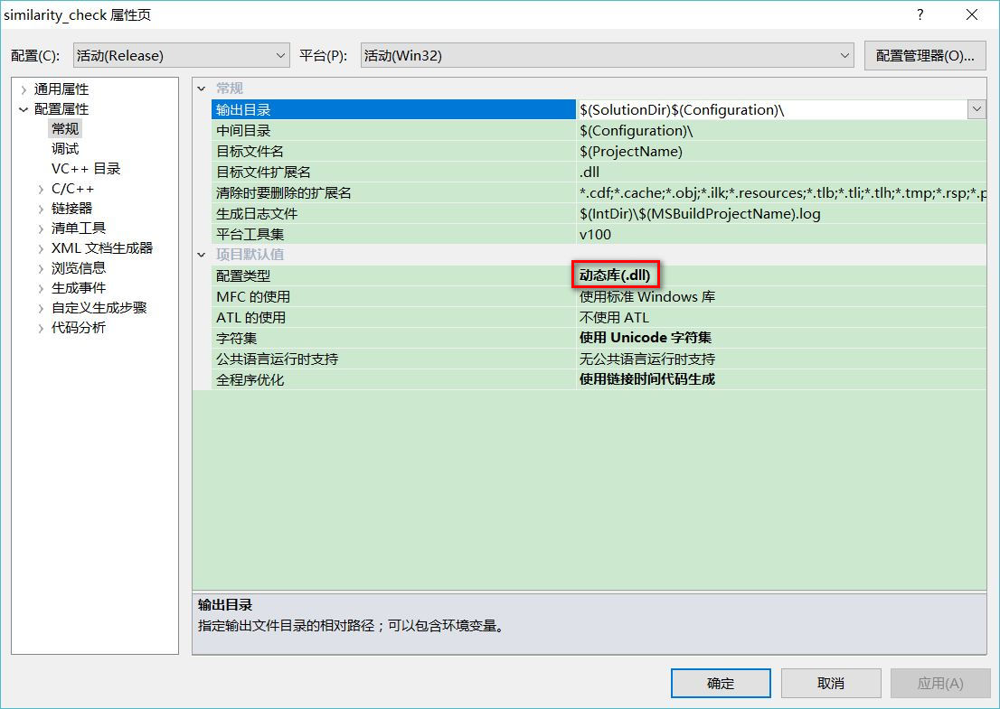

# 控制台工程转DLL工程

- 修改项目属性



- 接口头文件添加如下宏定义

```cppp
// 下列 ifdef 块是创建使从 DLL 导出更简单的
// 宏的标准方法。此 DLL 中的所有文件都是用命令行上定义的 SIMILARITY_CHECK_EXPORTS
// 符号编译的。在使用此 DLL 的
// 任何其他项目上不应定义此符号。这样，源文件中包含此文件的任何其他项目都会将
// SIMILARITY_CHECK_API 函数视为是从 DLL 导入的，而此 DLL 则将用此宏定义的
// 符号视为是被导出的。
#ifdef SIMILARITY_CHECK_EXPORTS
#define SIMILARITY_CHECK_API __declspec(dllexport)
#else
#define SIMILARITY_CHECK_API __declspec(dllimport)
#endif

SIMILARITY_CHECK_API void getInfo(const char* img);
```

- 添加预处理器定义:与接口文件中的宏定义对应，如`SIMILARITY_CHECK_EXPORTS`


