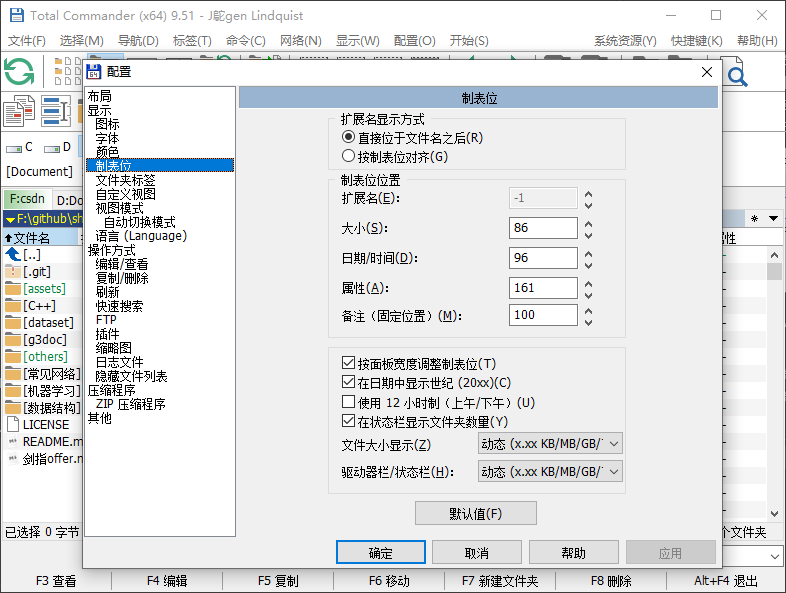

# Total Commander

## 常用快捷键

* `TAB` 切换左右面板
* `Ctrl` + `\` 返回到根目录
* `Alt` + `↓` 打开历史文件夹列表
* `Ctrl` + `D` 切换常用文件夹。

添加常用文件夹时，在标题名称后加上 `(&C)` ，表示可以通过 `Ctrl` + `D` + `C` 实现快速定位

* `Ctrl` + `G` 在当前路径打开CMD
* `Ctrl` + `↓` 下一命令行

* `Ctrl` + `2` 复制文件名
* `Ctrl` + `3` 复制文件绝对路径名

* `Alt` + `f1` / `f2` 快速选择左/右面板盘符 [link](https://www.zhihu.com/question/25150450)

-----

## 其它

文件名和文件后缀默认是分开显示的，可设置扩展名直接显示在文件名后。

