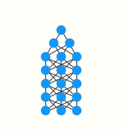

[Illustrated Guide to Recurrent Neural Networks](https://www.michaelphi.com/illustrated-guide-to-recurrent-neural-networks/)

Hi and welcome to an Illustrated guide to recurrent neural networks. I’m Michael also known as LearnedVector. I’m a machine learning engineer in the A. I. voice assistant space. If you are just getting started in ML and want to get some intuition behind Recurrent neural networks, this post is for you.

You can also watch the video version of this post if you prefer.

<iframe src="https://cdn.embedly.com/widgets/media.html?src=https%3A%2F%2Fwww.youtube.com%2Fembed%2FLHXXI4-IEns%3Ffeature%3Doembed&amp; url=http%3A%2F%2Fwww.youtube.com%2Fwatch%3Fv%3DLHXXI4-IEns&amp; image=https%3A%2F%2Fi.ytimg.com%2Fvi%2FLHXXI4-IEns%2Fhqdefault.jpg&amp; key=a19fcc184b9711e1b4764040d3dc5c07&amp; type=text%2Fhtml&amp; schema=youtube" allowfullscreen="" frameborder="0" title="Illustrated Guide to Recurrent Neural Networks: Understanding the Intuition" class="s t u id ai" scrolling="auto" name="fitvid0" style="box-sizing: inherit; border: 0px; display: block; overflow: hidden; width: 680px; position: absolute; top: 0px; left: 0px; height: 382.2px; "></iframe>

If you want to get into machine learning, recurrent neural networks are a powerful technique that is important to understand. If you use a smartphone or frequently surf the internet, odd’s are you’ve used applications that leverages RNN’s. Recurrent neural networks are used in speech recognition, language translation, stock predictions; It’s even used in image recognition to describe the content in pictures.

So I know there are many guides on recurrent neural networks, but I want to share illustrations along with an explanation, of how I came to understand it. I’m going to avoid all the math and focus on the intuition behind RNNs instead. By the end of this post, you should have a good understanding of RNN’s and hopefully, have that light bulb moment.

# **Sequence Data**

Ok so RNN’s are neural networks that are good at modeling sequence data. To understand what that means let’s do a thought experiment. Say you take a still snapshot of a ball moving in time.

Let’s also say you want to predict the direction that the ball was moving. So with only the information that you see on the screen, how would you do this? Well, you can go ahead and take a guess, but any answer you’d come up with would be that, a random guess. Without knowledge of where the ball has been, you wouldn’t have enough data to predict where it’s going.

If you record many snapshots of the ball’s position in succession, you will have enough information to make a better prediction.

So this is a sequence, a particular order in which one thing follows another. With this information, you can now see that the ball is moving to the right.

Sequence data comes in many forms. Audio is a natural sequence. You can chop up an audio spectrogram into chunks and feed that into RNN’s.

Text is another form of sequences. You can break Text up into a sequence of characters or a sequence of words.

# **Sequential Memory**

Ok so, RNN’s are good at processing sequence data for predictions. But how??

Well, they do that by having a concept I like to call sequential memory. To get a good intuition behind what sequential memory means…

I want to invite you to say the alphabet in your head.

That was pretty easy right. If you were taught this specific sequence, it should come quickly to you.

Now try saying the alphabet backward.

I bet this is much harder. Unless you’ve practiced this specific sequence before, you’ll likely have a hard time.

Here’s a fun one, start at the letter F.

At first, you’ll struggle with the first few letters, but then after your brain picks up the pattern, the rest will come naturally.

So there is a very logical reason why this can be difficult. You learn the alphabet as a sequence. Sequential memory is a mechanism that makes it easier for your brain to recognize sequence patterns.

# **Recurrent Neural Networks**

Alright so RNN’s have this abstract concept of sequential memory, but how the heck does an RNN replicate this concept? Well, let’s look at a traditional neural network also known as a feed-forward neural network. It has its input layer, hidden layer, and the output layer.

How do we get a feed-forward neural network to be able to use previous information to effect later ones? What if we add a loop in the neural network that can pass prior information forward?

And that’s essentially what a recurrent neural network does. An RNN has a looping mechanism that acts as a highway to allow information to flow from one step to the next.

This information is the hidden state, which is a representation of previous inputs. Let’s run through an RNN use case to have a better understanding of how this works.

Let’s say we want to build a chatbot. They’re pretty popular nowadays. Let’s say the chatbot can classify intentions from the users inputted text.

To tackle this problem. First, we are going to encode the sequence of text using an RNN. Then, we are going to feed the RNN output into a feed-forward neural network which will classify the intents.

Ok, so a user types in… ***\**\*what time is it?\*\**\***. To start, we break up the sentence into individual words. RNN’s work sequentially so we feed it one word at a time.

The first step is to feed “What” into the RNN. The RNN encodes “What” and produces an output.

For the next step, we feed the word “time” and the hidden state from the previous step. The RNN now has information on both the word “What” and “time.”

We repeat this process, until the final step. You can see by the final step the RNN has encoded information from all the words in previous steps.

Since the final output was created from the rest of the sequence, we should be able to take the final output and pass it to the feed-forward layer to classify an intent.

For those of you who like looking at code here is some python showcasing the control flow.

First, you initialize your network layers and the initial hidden state. The shape and dimension of the hidden state will be dependent on the shape and dimension of your recurrent neural network. Then you loop through your inputs, pass the word and hidden state into the RNN. The RNN returns the output and a modified hidden state. You continue to loop until you’re out of words. Last you pass the output to the feedforward layer, and it returns a prediction. And that’s it! The control flow of doing a forward pass of a recurrent neural network is a for loop.

# **Vanishing Gradient**

You may have noticed the odd distribution of colors in the hidden states. That is to illustrate an issue with RNN’s known as short-term memory.

Short-term memory is caused by the infamous vanishing gradient problem, which is also prevalent in other neural network architectures. As the RNN processes more steps, it has troubles retaining information from previous steps. As you can see, the information from the word “what” and “time” is almost non-existent at the final time step. Short-Term memory and the vanishing gradient is due to the nature of back-propagation; an algorithm used to train and optimize neural networks. To understand why this is, let’s take a look at the effects of back propagation on a deep feed-forward neural network.

Training a neural network has three major steps. First, it does a forward pass and makes a prediction. Second, it compares the prediction to the ground truth using a loss function. The loss function outputs an error value which is an estimate of how poorly the network is performing. Last, it uses that error value to do back propagation which calculates the gradients for each node in the network.

The gradient is the value used to adjust the networks internal weights, allowing the network to learn. The bigger the gradient, the bigger the adjustments and vice versa. Here is where the problem lies. When doing back propagation, each node in a layer calculates it’s gradient with respect to the effects of the gradients, in the layer before it. So if the adjustments to the layers before it is small, then adjustments to the current layer will be even smaller.

That causes gradients to exponentially shrink as it back propagates down. The earlier layers fail to do any learning as the internal weights are barely being adjusted due to extremely small gradients. And that’s the vanishing gradient problem.

Let’s see how this applies to recurrent neural networks. You can think of each time step in a recurrent neural network as a layer. To train a recurrent neural network, you use an application of back-propagation called back-propagation through time. The gradient values will exponentially shrink as it propagates through each time step.

Again, the gradient is used to make adjustments in the neural networks weights thus allowing it to learn. Small gradients mean small adjustments. That causes the early layers not to learn.

Because of vanishing gradients, the RNN doesn’t learn the long-range dependencies across time steps. That means that there is a possibility that the word “what” and “time” are not considered when trying to predict the user’s intention. The network then has to make the best guess with “is it?”. That’s pretty ambiguous and would be difficult even for a human. So not being able to learn on earlier time steps causes the network to have a short-term memory.

# **LSTM’s and GRU’s**

Ok so RNN’s suffer from short-term memory, so how do we combat that? To mitigate short-term memory, two specialized recurrent neural networks were created. One called Long Short-Term Memory or LSTM’s for short. The other is Gated Recurrent Units or GRU’s. LSTM’s and GRU’s essentially function just like RNN’s, but they’re capable of learning long-term dependencies using mechanisms called “gates.” These gates are different tensor operations that can learn what information to add or remove to the hidden state. Because of this ability, short-term memory is less of an issue for them. If you’d like to learn more about LSTM’s and GRU’s you can view my post on them.

[Illustrated Guide to LSTM’s and GRU’s: A step by step explanation](https://towardsdatascience.com/illustrated-guide-to-lstms-and-gru-s-a-step-by-step-explanation-44e9eb85bf21)

# That wasn’t too bad

To sum this up, RNN’s are good for processing sequence data for predictions but suffers from short-term memory. The short-term memory issue for vanilla RNN’s doesn’t mean to skip them entirely and use the more evolved versions like LSTM’s or GRU’s. RNN’s have the benefit of training faster and uses less computational resources. That’s because there are fewer tensor operations to compute. You should use LSTM’s or GRU’s when you expect to model longer sequences with long-term dependencies.

If you’re interested in going deeper, here are some links explaining RNN’s and it’s variants.

[Anyone Can Learn To Code an LSTM-RNN in Python (Part 1: RNN) - i am traskA machine learning craftsmanship ](https://iamtrask.github.io/2015/11/15/anyone-can-code-lstm/)

[https://colah.github.io/posts/2015-08-Understanding-LSTMs/]

I had a lot of fun making this post so let me know in the comments if this was helpful or what you would like to see in the next one. Thanks for reading!
