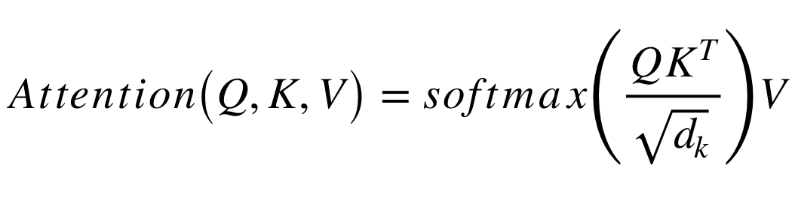
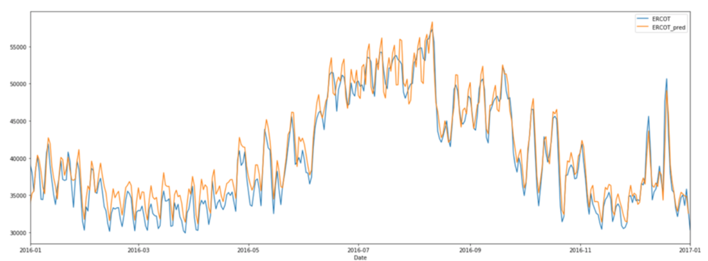

# [What is a Transformer?](https://medium.com/inside-machine-learning/what-is-a-transformer-d07dd1fbec04)

[Jan 5, 2019](https://medium.com/inside-machine-learning/what-is-a-transformer-d07dd1fbec04) · 13 min read

# An Introduction to Transformers and Sequence-to-Sequence Learning for Machine Learning

New deep learning models are introduced at an increasing rate and sometimes it’s hard to keep track of all the novelties. That said, one particular neural network model has proven to be especially effective for common natural language processing tasks. The model is called a Transformer and it makes use of several methods and mechanisms that I’ll introduce here. The papers I refer to in the post offer a more detailed and quantitative description.

# **Part 1: Sequence to Sequence Learning and Attention**

[The paper](https://arxiv.org/abs/1706.03762) ‘Attention Is All You Need’ describes transformers and what is called a sequence-to-sequence architecture. Sequence-to-Sequence (or Seq2Seq) is a neural net that transforms a given sequence of elements, such as the sequence of words in a sentence, into another sequence. (Well, this might not surprise you considering the name.)

Seq2Seq models are particularly good at translation, where the sequence of words from one language is transformed into a sequence of different words in another language. A popular choice for this type of model is Long-Short-Term-Memory (LSTM)-based models. With sequence-dependent data, the LSTM modules can give meaning to the sequence while remembering (or forgetting) the parts it finds important (or unimportant). Sentences, for example, are sequence-dependent since the order of the words is crucial for understanding the sentence. LSTM are a natural choice for this type of data.

Seq2Seq models consist of an Encoder and a Decoder. The Encoder takes the input sequence and maps it into a higher dimensional space (n-dimensional vector). That abstract vector is fed into the Decoder which turns it into an output sequence. The output sequence can be in another language, symbols, a copy of the input, etc.

Imagine the Encoder and Decoder as human translators who can speak only two languages. Their first language is their mother tongue, which differs between both of them (e.g. German and French) and their second language an imaginary one they have in common. To translate German into French, the Encoder converts the German sentence into the other language it knows, namely the imaginary language. Since the Decoder is able to read that imaginary language, it can now translates from that language into French. Together, the model (consisting of Encoder and Decoder) can translate German into French!

Suppose that, initially, neither the Encoder or the Decoder is very fluent in the imaginary language. To learn it, we train them (the model) on a lot of examples.

A very basic choice for the Encoder and the Decoder of the Seq2Seq model is a single LSTM for each of them.

You’re wondering when the Transformer will finally come into play, aren’t you?

We need one more technical detail to make Transformers easier to understand: *Attention*. The attention-mechanism looks at an input sequence and decides at each step which other parts of the sequence are important. It sounds abstract, but let me clarify with an easy example: When reading this text, you always focus on the word you read but at the same time your mind still holds the important keywords of the text in memory in order to provide context.

An attention-mechanism works similarly for a given sequence. For our example with the human Encoder and Decoder, imagine that instead of only writing down the translation of the sentence in the imaginary language, the Encoder also writes down keywords that are important to the semantics of the sentence, and gives them to the Decoder in addition to the regular translation. Those new keywords make the translation much easier for the Decoder because it knows what parts of the sentence are important and which key terms give the sentence context.

In other words, for each input that the LSTM (Encoder) reads, the attention-mechanism takes into account several other inputs at the same time and decides which ones are important by attributing different weights to those inputs. The Decoder will then take as input the encoded sentence and the weights provided by the attention-mechanism. To learn more about attention, see [this article](https://skymind.ai/wiki/attention-mechanism-memory-network). And for a more scientific approach than the one provided, read about different attention-based approaches for Sequence-to-Sequence models in [this great paper](https://nlp.stanford.edu/pubs/emnlp15_attn.pdf) called *‘Effective Approaches to Attention-based Neural Machine Translation’.*

# **Part 2: The Transformer**

The paper ‘Attention Is All You Need’ introduces a novel architecture called Transformer. As the title indicates, it uses the attention-mechanism we saw earlier. Like LSTM, Transformer is an architecture for transforming one sequence into another one with the help of two parts (Encoder and Decoder), but it differs from the previously described/existing sequence-to-sequence models because it does not imply any Recurrent Networks (GRU, LSTM, etc.).

Recurrent Networks were, until now, one of the best ways to capture the timely dependencies in sequences. However, the team presenting the paper proved that an architecture with only attention-mechanisms without any RNN (Recurrent Neural Networks) can improve on the results in translation task and other tasks! One improvement on Natural Language Tasks is presented by a team introducing BERT: [BERT: Pre-training of Deep Bidirectional Transformers for Language Understanding](https://arxiv.org/abs/1810.04805).

So, what exactly is a Transformer?

An image is worth thousand words, so we will start with that!

*Figure 1: From ‘Attention Is All You Need’ by Vaswani et al.*

The Encoder is on the left and the Decoder is on the right. Both Encoder and Decoder are composed of modules that can be stacked on top of each other multiple times, which is described by *Nx* in the figure. We see that the modules consist mainly of Multi-Head Attention and Feed Forward layers. The inputs and outputs (target sentences) are first embedded into an n-dimensional space since we cannot use strings directly.

One slight but important part of the model is the positional encoding of the different words. Since we have no recurrent networks that can remember how sequences are fed into a model, we need to somehow give every word/part in our sequence a relative position since a sequence depends on the order of its elements. These positions are added to the embedded representation (n-dimensional vector) of each word.

Let’s have a closer look at these Multi-Head Attention bricks in the model:

*Figure 2. From ‘Attention Is All You Need’ by Vaswani et al.*

Let’s start with the left description of the attention-mechanism. It’s not very complicated and can be described by the following equation:

Q is a matrix that contains the query (vector representation of one word in the sequence), K are all the keys (vector representations of all the words in the sequence) and V are the values, which are again the vector representations of all the words in the sequence. For the encoder and decoder, multi-head attention modules, V consists of the same word sequence than Q. However, for the attention module that is taking into account the encoder and the decoder sequences, V is different from the sequence represented by Q.

To simplify this a little bit, we could say that the values in V are multiplied and summed with some attention-weights *a, * where our weights are defined by:

This means that the weights *a* are defined by how each word of the sequence (represented by Q) is influenced by all the other words in the sequence (represented by K). Additionally, the SoftMax function is applied to the weights *a* to have a distribution between 0 and 1. Those weights are then applied to all the words in the sequence that are introduced in V (same vectors than Q for encoder and decoder but different for the module that has encoder and decoder inputs).

The righthand picture describes how this attention-mechanism can be parallelized into multiple mechanisms that can be used side by side. The attention mechanism is repeated multiple times with linear projections of Q, K and V. This allows the system to learn from different representations of Q, K and V, which is beneficial to the model. These linear representations are done by multiplying Q, K and V by weight matrices W that are learned during the training.

Those matrices Q, K and V are different for each position of the attention modules in the structure depending on whether they are in the encoder, decoder or in-between encoder and decoder. The reason is that we want to attend on either the whole encoder input sequence or a part of the decoder input sequence. The multi-head attention module that connects the encoder and decoder will make sure that the encoder input-sequence is taken into account together with the decoder input-sequence up to a given position.

After the multi-attention heads in both the encoder and decoder, we have a pointwise feed-forward layer. This little feed-forward network has identical parameters for each position, which can be described as a separate, identical linear transformation of each element from the given sequence.

## **Training**

How to train such a ‘beast’? Training and inferring on Seq2Seq models is a bit different from the usual classification problem. The same is true for Transformers.

We know that to train a model for translation tasks we need two sentences in different languages that are translations of each other. Once we have a lot of sentence pairs, we can start training our model. Let’s say we want to translate French to German. Our encoded input will be a French sentence and the input for the decoder will be a German sentence. However, the decoder input will be shifted to the right by one position. .. Wait, why?

One reason is that we do not want our model to learn how to copy our decoder input during training, but we want to learn that given the encoder sequence and a particular decoder sequence, which has been already seen by the model, we predict the next word/character.

If we don’t shift the decoder sequence, the model learns to simply ‘copy’ the decoder input, since the target word/character for position *i* would be the word/character *i* in the decoder input. Thus, by shifting the decoder input by one position, our model needs to predict the target word/character for position *i* having only seen the word/characters *1, …, i-1* in the decoder sequence. This prevents our model from learning the copy/paste task. We fill the first position of the decoder input with a start-of-sentence token, since that place would otherwise be empty because of the right-shift. Similarly, we append an end-of-sentence token to the decoder input sequence to mark the end of that sequence and it is also appended to the target output sentence. In a moment, we’ll see how that is useful for inferring the results.

This is true for Seq2Seq models and for the Transformer. In addition to the right-shifting, the Transformer applies a mask to the input in the first multi-head attention module to avoid seeing potential ‘future’ sequence elements. This is specific to the Transformer architecture because we do not have RNNs where we can input our sequence sequentially. Here, we input everything together and if there were no mask, the multi-head attention would consider the whole decoder input sequence at each position.

The process of feeding the correct shifted input into the decoder is also called Teacher-Forcing, as described in [this blog](https://machinelearningmastery.com/teacher-forcing-for-recurrent-neural-networks/).

The target sequence we want for our loss calculations is simply the decoder input (German sentence) without shifting it and with an end-of-sequence token at the end.

## **Inference**

Inferring with those models is different from the training, which makes sense because in the end we want to translate a French sentence without having the German sentence. The trick here is to re-feed our model for each position of the output sequence until we come across an end-of-sentence token.

A more step by step method would be:

* Input the full encoder sequence (French sentence) and as decoder input, we take an empty sequence with only a start-of-sentence token on the first position. This will output a sequence where we will only take the first element.
* That element will be filled into second position of our decoder input sequence, which now has a start-of-sentence token and a first word/character in it.
* Input both the encoder sequence and the new decoder sequence into the model. Take the second element of the output and put it into the decoder input sequence.
* Repeat this until you predict an end-of-sentence token, which marks the end of the translation.

We see that we need multiple runs through our model to translate our sentence.

I hope that these descriptions have made the Transformer architecture a little bit clearer for everybody starting with Seq2Seq and encoder-decoder structures.

# **Part 3: Use-Case ‘Transformer for Time-Series’**

We have seen the Transformer architecture and we know from literature and the [‘Attention is All you Need’ authors](https://arxiv.org/pdf/1706.03762.pdf) that the model does extremely well in language tasks. Let’s now test the Transformer in a use case.

Instead of a translation task, let’s implement a time-series forecast for the hourly flow of electrical power in Texas, provided by the Electric Reliability Council of Texas (ERCOT). You can find the hourly data [here](http://www.ercot.com/gridinfo/load/load_hist/).

A great detailed explanation of the Transformer and its implementation is provided by [harvardnlp](http://nlp.seas.harvard.edu/2018/04/03/attention.html). If you want to dig deeper into the architecture, I recommend going through that implementation.

Since we can use LSTM-based sequence-to-sequence models to make multi-step forecast predictions, let’s have a look at the Transformer and its power to make those predictions. However, we first need to make a few changes to the architecture since we are not working with sequences of words but with values. Additionally, we are doing an auto-regression and not a classification of words/characters.

## **The Data**

The available data gives us hourly load for the entire ERCOT control area. I used the data from the years 2003 to 2015 as a training set and the year 2016 as test set. Having only the load value and the timestamp of the load, I expanded the timestamp to other features. From the timestamp, I extracted the weekday to which it corresponds and one-hot encoded it. Additionally, I used the year (2003, 2004, …, 2015) and the corresponding hour (1, 2, 3, …, 24) as the value itself. This gives me 11 features in total for each hour of the day. For convergence purposes, I also normalized the ERCOT load by dividing it by 1000.

To predict a given sequence, we need a sequence from the past. The size of those windows can vary from use-case to use-case but here in our example I used the hourly data from the previous 24 hours to predict the next 12 hours. It helps that we can adjust the size of those windows depending on our needs. For example, we can change that to daily data instead of hourly data.

## **Changes to the model from the paper**

As a first step, we need to remove the embeddings, since we already have numerical values in our input. An embedding usually maps a given integer into an n-dimensional space. Here instead of using the embedding, I simply used a linear transformation to transform the 11-dimensional data into an n-dimensional space. This is similar to the embedding with words.

We also need to remove the SoftMax layer from the output of the Transformer because our output nodes are not probabilities but real values.

After those minor changes, the training can begin!

As mentioned, I used teacher forcing for the training. This means that the encoder gets a window of 24 data points as input and the decoder input is a window of 12 data points where the first one is a ‘start-of-sequence’ value and the following data points are simply the target sequence. Having introduced a ‘start-of-sequence’ value at the beginning, I shifted the decoder input by one position with regard to the target sequence.

I used an 11-dimensional vector with only -1’s as the ‘start-of-sequence’ values. Of course, this can be changed and perhaps it would be beneficial to use other values depending of the use case but for this example, it works since we never have negative values in either dimension of the input/output sequences.

The loss function for this example is simply the mean squared error.

## **Results**

The two plots below show the results. I took the mean value of the hourly values per day and compared it to the correct values. The first plot shows the 12-hour predictions given the 24 previous hours. For the second plot, we predicted one hour given the 24 previous hours. We see that the model is able to catch some of the fluctuations very well. The root mean squared error for the training set is 859 and for the validation set it is 4, 106 for the 12-hour predictions and 2, 583 for the 1-hour predictions. This corresponds to a mean absolute percentage error of the model prediction of 8.4% for the first plot and 5.1% for the second one.

Figure 3: 12-hour prediction given previous 24 hours over one year

Figure 4: 1-hour prediction given previous 24 hours over one year

# Summary

The results show that it would be possible to use the Transformer architecture for time-series forecasting. However, during the evaluation, it shows that the more steps we want to forecast the higher the error will become. The first graph (Figure 3) above has been achieved by using the 24 hours to predict the next 12 hours. If we predict only one hour, the results are much better as we see on the second the graph (Figure 4).

There’s plenty of room to play around with the parameters of the Transformer, such as the number of decoder and encoder layers, etc. This was not intended to be a perfect model and with better tuning and training, the results would probably improve.

It can be a big help to accelerate the training using GPUs. I used the Watson Studio Local Platform to train my model with GPUs and I let it run there rather than on my local machine. You can also accelerate the training using Watson’s Machine Learning GPUs which are free up to a certain amount of training time! Check out [my previous blog](https://medium.com/inside-machine-learning/leveraging-watsons-machine-learning-gpus-to-accelerate-your-deep-learning-project-in-python-e4ccf497a5f3) to see how that can be integrated easily into your code.

Thank you very much for reading this and I hope I was able to clarify a few notions to the people who are just starting to get into Deep Learning!
