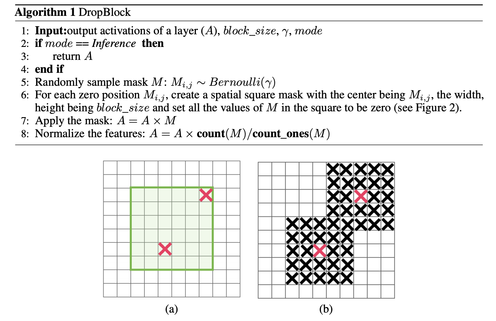

# [YOLOv4](https://jonathan-hui.medium.com/yolov4-c9901eaa8e61)

Even object detection starts maturing in the last few years, the competition remains fierce. As shown below, YOLOv4 claims to have state-of-the-art accuracy while maintains a high processing frame rate. It achieves an accuracy of 43.5% AP (65.7% AP₅₀) for the MS COCO with an approximately 65 FPS inference speed on Tesla V100. In object detection, high accuracy is not the only holy grail anymore. We want the model to run smoothly in the edge devices. How to process input video in real-time with low-cost hardware becomes important also.


[Source](https://arxiv.org/pdf/2004.10934.pdf)

The fun part of reading the YOLOv4 development is what new technologies have been evaluated, modified, and integrated into YOLOv4. And it also makes changes to make the detector more suitable for training on a single GPU.

# Bag of freebies (Bof) & Bag of specials (BoS)

Improvements can be made in the training process (like data augmentation, class imbalance, cost function, soft labeling etc…) to advance accuracy. These improvements have no impact on inference speed and called “bag of freebies”. Then, there are “bag of specials” which impacts the inference time slightly with a good return in performance. These improvements include the increase of the receptive field, the use of attention, feature integration like skip-connections & FPN, and post-processing like non-maximum suppression. In this article, we will discuss how the feature extractor and the neck are designed as well as all these Bof and BoS goodies.

# Backbone

**Dense Block & DenseNet**

To improve accuracy, we can design a deeper network to extend the receptive field and to increase model complexity. And to ease the training difficulty, skip-connections can be applied. We can expand this concept further with highly interconnected layers.

A **Dense Block** contains multiple convolution layers with each layer *Hi* composed of batch normalization, ReLU, and followed by convolution. Instead of using the output of the last layer only, *Hi* takes the output of all previous layers as well as the original as its input. i.e. *x*₀, *x*₁, …, and *xᵢ*₋₁. Each *Hi* below outputs four feature maps. Therefore, at each layer, the number of feature maps is increased by four — the growth rate.


[Source](https://arxiv.org/pdf/1608.06993.pdf)

Then a DenseNet can be formed by composing multiple Dense Block with a transition layer in between that composed of convolution and pooling.


[Source](https://arxiv.org/pdf/1608.06993.pdf)

Below is the detailed architectural design.


[Source](https://arxiv.org/pdf/1608.06993.pdf)

**Cross-Stage-Partial-connections (CSP)**

CSPNet separates the input feature maps of the DenseBlock into two parts. The first part *x₀’* bypasses the DenseBlock and becomes part of the input to the next transition layer. The second part *x₀’’* will go thought the Dense block as below.


[Source](https://arxiv.org/pdf/1911.11929.pdf)

This new design reduces the computational complexity by separating the input into two parts — with only one going through the Dense Block.


[Source](https://arxiv.org/pdf/1911.11929.pdf)

**CSPDarknet53**

YOLOv4 utilizes the CSP connections above with the Darknet-53 below as the backbone in feature extraction.


[Source](https://arxiv.org/pdf/1804.02767.pdf)

The CSPDarknet53 model has higher accuracy in object detection compared with ResNet based designs even they have a better classification performance. But the classification accuracy of CSPDarknet53 can be improved with Mish and other techniques discussed later. The final choice for YOLOv4 is therefore CSPDarknet53.

# **Neck**

Object detectors composed of a backbone in feature extraction and a head (the rightmost block below) for object detection. And to detect objects at different scales, a hierarchy structure is produced with the head probing feature maps at different spatial resolutions.


Modified from [source](https://arxiv.org/pdf/2004.10934.pdf)

To enrich the information that feeds into the head, neighboring feature maps coming from the bottom-up stream and the top-down stream are added together element-wise or concatenated before feeding into the head. Therefore, the head’s input will contain spatial rich information from the bottom-up stream and the semantic rich information from the top-down stream. This part of the system is called a neck. Let’s get more details in its design.

**Feature Pyramid Networks (FPN)**

YOLOv3 adapts a similar approach as FPN in making object detection predictions at different scale levels.


[Source](https://arxiv.org/pdf/1612.03144.pdf) (FPN)

In making predictions for a particular scale, FPN upsamples (2×) the previous top-down stream and add it with the neighboring layer of the bottom-up stream (see the diagram below). The result is passed into a 3×3 convolution filter to reduce upsampling artifacts and create the feature maps P4 below for the head.


**SPP (spatial pyramid pooling layer)**

SPP applies a slightly different strategy in detecting objects of different scales. It replaces the last pooling layer (after the last convolutional layer) with a spatial pyramid pooling layer. The feature maps are spatially divided into *m*×*m* bins with *m*, say, equals 1, 2, and 4 respectively. Then a maximum pool is applied to each bin for each channel. This forms a fixed-length representation that can be further analyzed with FC-layers.


[Source](https://arxiv.org/pdf/1406.4729.pdf)

Many CNN-based models containing FC-layers and therefore, accepts input images of specific dimensions only. In contrast, SPP accepts images of different sizes. Nevertheless, there are technologies like fully convolution networks (FCN) that contain no FC-layers and accepts images of different dimensions. This type of design is particularly useful for image segmentation which spatial information is important. Therefore, for YOLO, convert 2-D feature maps into a fixed-size 1-D vector is not necessarily desirable.

**YOLO with SPP**

In YOLO, the SPP is modified to retain the output spatial dimension. A maximum pool is applied to a sliding kernel of size say, 1×1, 5×5, 9×9, 13×13. The spatial dimension is preserved. The features maps from different kernel sizes are then concatenated together as output.


[Source](https://arxiv.org/pdf/1903.08589.pdf)

The diagram below demonstrates how SPP is integrated into YOLO.


[Source](https://arxiv.org/pdf/1903.08589.pdf)

**Path Aggregation Network (PAN)**

In early DL, the model design is relatively simple. Each layer takes input from the previous layer. The early layers extract localized texture and pattern information to build up the semantic information needed in the later layers. However, as we progress to the right, localized information that may be needed to fine-tune the prediction may be lost.


[Source](https://arxiv.org/pdf/1506.02640.pdf)

In later DL development, the interconnectivity among layers is getting more complex. In DenseNet, it goes to the extreme. Each layer is connected with all previous layers.


Modified from [source](https://arxiv.org/pdf/1608.06993.pdf)

In FPN, information is combined from neighboring layers in the bottom-up and top-down stream.


The flow of information among layers becomes another key decision in the model design.

The diagram below is the Path Aggregation Network (PAN) for object detection. A bottom-up path (b) is augmented to make low-layer information easier to propagate to the top. In FPN, the localized spatial information traveled upward in the red arrow. While not clearly demonstrates in the diagram, the red path goes through about 100+ layers. PAN introduced a short-cut path (the green path) which only takes about 10 layers to go to the top N₅ layer. This short-circuit concepts make fine-grain localized information available to top layers.


[Source](https://arxiv.org/pdf/1803.01534.pdf)

As a side note, the neck design can be visualized as the following:


[Source](https://arxiv.org/pdf/1911.09070.pdf)

However, instead of adding neighbor layers together, features maps are concatenated together in YOLOv4.


[Source](https://arxiv.org/pdf/2004.10934.pdf)

In FPN, objects are detected separately and independently at different scale levels. This may produce duplicated predictions and not utilize information from other feature maps. PAN fuses the information together from all layers first using element-wise max operation (we will skip the [details](https://arxiv.org/pdf/1803.01534.pdf) here).


[Source](https://arxiv.org/pdf/1803.01534.pdf)

**Spatial Attention Module (SAM)**

Attention has widely adopted in DL designs. In SAM, maximum pool and average pool are applied separately to input feature maps to create two sets of feature maps. The results are feed into a convolution layer followed by a sigmoid function to create spatial attention.


[Source](https://arxiv.org/pdf/1807.06521.pdf)

This spatial attention mask is applied to the input feature to output the refined feature maps.


[Source](https://arxiv.org/pdf/1807.06521.pdf)

In YOLOv4, a modified SAM is used without applying the maximum and average pooling.


[Source](https://arxiv.org/pdf/2004.10934.pdf)

In YOLOv4, the FPN concept is gradually implemented/replaced with the modified SPP, PAN, and PAN.

# Bag of Freebies (BoF) for backbone

The BoF features for YOLOv4 backbone include:

* CutMix and Mosaic data augmentation,
* DropBlock regularization, and
* Class label smoothing

**CutMix data augmentation**

Cutout data augmentation removes a region of an image (see the diagram below). This forces the model not to be overconfident on specific features in making classifications. However, a portion of the image is filled with useless information and this is a waste. In CutMix, a portion of an image is cut-and-paste over another image. The ground truth labels are readjusted proportionally to the area of the patches, e.g. 0.6 like a dog and 0.4 like a cat.


[Source](https://arxiv.org/pdf/1905.04899.pdf)

Conceptually, CutMix has a broader view of what an object may compose of. The cutout area forces the model to learn object classification with different sets of features. This avoids overconfidence. Since that area is replaced with another image, the amount of information in the image and the training efficient will not be impacted significantly also.

**Mosaic data augmentation**

Mosaic is a data augmentation method that combines 4 training images into one for training (instead of 2 in CutMix). This enhances the detection of objects outside their normal context. In addition, each mini-batch contains a large variant of image (4×) and therefore, reduces the need for large mini-batch sizes in estimating the mean and the variance.


[Source](https://arxiv.org/pdf/2004.10934.pdf)

**DropBlock regularization**

In Fully-connected layers, we can apply dropoff to force the model to learn from a variety of features instead of being too confident on a few. However, this may not work for convolution layers. Neighboring positions are highly correlated. So even some of the pixels are dropped (the middle diagram below), the spatial information remains detectable. DropBlock regularization builds on a similar concept that works on convolution layers.


[Source](http://dropblock%20regularization/)

Instead of dropping individual pixels, a block of block_size × block_size of pixels is dropped.



[Source](http://dropblock%20regularization/)

**Class label smoothing**

Whenever you feel absolutely right, you may be plainly wrong. A 100% confidence in a prediction may reveal that the model is memorizing the data instead of learning. Label smoothing adjusts the target upper bound of the prediction to a lower value say 0.9. And it will use this value instead of 1.0 in calculating the loss. This concept mitigates overfitting.

```python
p = tf.placeholder(tf.float32, shape=[None, 10])
# Use 0.9 instead of 1.0.
feed_dict = {
  p: [[0, 0, 0, 0.9, 0, 0, 0, 0, 0, 0]] # Image with label "3"
}
# logits_real_image is the logits calculated by
# the discriminator for real images.
d_real_loss = tf.nn.sigmoid_cross_entropy_with_logits(
                    labels=p, logits=logits_real_image)
```

# Bag of Specials (BoS) for backbone

* Mish activation,
* Cross-stage partial connections (CSP), and
* Multi-input weighted residual connections (MiWRC)

**Mish activation**

Let’s assume the activation function is in the form of


[Source](https://arxiv.org/pdf/1710.05941.pdf)

with different function candidates (like cosine function) for the unary or binary operators. We can make random guesses in selecting these functions and evaluating the corresponding model performances based on different tasks (like classification) and datasets. Finally, we can pick an activation function that performs the best.

Applying reinforcement learning, we can search the solution space more efficiently.


[Source](https://arxiv.org/pdf/1710.05941.pdf)

Using this method followed by experiments, the new activation function below, called Swish, shows better performance than ReLU and many other activation functions.


[Source](https://arxiv.org/pdf/1710.05941.pdf) (Swish activation function with different values of β)

Mish is another activation function with a close similarity to ReLU and Swish. As claimed by the [paper](https://arxiv.org/pdf/1908.08681.pdf), Mish can outperform them in many deep networks across different datasets.


[Source](https://arxiv.org/pdf/1908.08681.pdf)

Using Mish for the CSPDarknet53 and the detector, it increases both accuracies in YOLOv4.

**Multi-input weighted residual connections (MiWRC)**

For the past few years, researchers have paid a lot of attention to what feature maps will be fed into a layer. Sometimes, we break away from the tradition that only the previous layer is used.

How layers are connected becomes more important now, in particular for object detectors. We have discussed FPN and PAN so far as examples. The diagram (d) below shows another neck design called BiFPN that has better accuracy and efficiency trade-offs according to the BiFPN [paper](https://arxiv.org/pdf/1911.09070.pdf).


[Source](https://arxiv.org/pdf/1911.09070.pdf)

In YOLOv4, it compares its performance with the EfficientDet which is considered as one of the state-of-the-art technology by YOLOv4. So let’s spend some time studying it. As shown below, EfficientDet uses the EfficientNet as the backbone feature extractor and BiFPN as the neck.


[Source](https://arxiv.org/pdf/1911.09070.pdf)

As a reference, the diagram below is the architecture for the EfficientNet which builds on the MBConv layers that compose of the inverted residual block.


As quoted in the [paper](https://arxiv.org/pdf/1801.04381.pdf), the inverted residual block consists of

> The first layer is called a depthwise convolution, it performs lightweight filtering by applying a single convolutional filter per input channel. The second layer is a 1 × 1 convolution, called a pointwise convolution, which is responsible for building new features through computing linear combinations of the input channels.

Let’s assume the input is of dimension *hᵢ × wᵢ × dᵢ*. It applies *dᵢ* convolution filters of *k* *× k —* one for each channel. Then it applies 1*×* 1 convolution filters to all channels to produce an output of *hᵢ × wᵢ × dⱼ*. So the total computational complexity is:


The key advantage is it requires much lower computation than the traditional convolution layer.

In many ML and DL problems, we learn a low-dimensional representation of the input. We extract the core information of the data by creating an “information” bottleneck. That forces us to discover the most important information which is the core principle of learning. Following this principle, an Inverted residual block takes a low-dimensional representation as input and manipulate it with convolution (linear operation) and non-linear operations. But there is a major issue on the non-linear parts like ReLU. Non-linear operations stretch or compress regions un-proportionally. In such compression, inputs may map to the same regions/points. For example, ReLU may collapse the channel in this low dimensional space and inevitably lose information. As quoted from the paper:

> It is important to remove non-linearities in the narrow layers
> in order to maintain representational power.

To address that, we can temporarily expand the dimension (the number of channels). With the hope that we have lots of channels now and information may still be preserved in some channels after the non-linear operations. Here is the detail of an inverted residual block:


[Source](https://arxiv.org/pdf/1801.04381.pdf)

As shown, the low-dimensional representation is first expanded to *tk* channels. Then, it is filtered with lightweight 3 *× 3* depthwise convolution. Features are then subsequently reduced back to a low-dimensional at the end of the module. Non-linear operations are added when it remains in the higher-dimensional space.


[Source](https://arxiv.org/pdf/1801.04381.pdf)

A residual connection is added from the beginning to the end of the module. The diagram on the left is the traditional residual block and the right is the described inverted residual block.


[Source](https://arxiv.org/pdf/1801.04381.pdf)

It is nice to understand the key concept of EfficientDet. But the main contribution of EfficientDet on YOLOv4 is the Multi-input weighted residual connections. In the EfficientDet paper, it observes that different input features are at different resolutions and it contributes to the output feature unequally. But in our previous discussion, we add those features equally. In EfficientDet, the input features are weighted differently in composing the output as:


[Source](https://arxiv.org/pdf/1911.09070.pdf)

where *wᵢ* will be trained and learned like other trainable parameters.

# Bag of Freebies (BoF) for detector

The BoF features for YOLOv4 detector include:

* CIoU-loss,
* CmBN,
* DropBlock regularization,
* Mosaic data augmentation,
* Self-Adversarial Training,
* Eliminate grid sensitivity,
* Using multiple anchors for a single ground truth,
* Cosine annealing scheduler,
* Optimal hyperparameters, and
* Random training shapes

**CIoU-loss**

A loss function gives us signals on how to adjust weights to reduce cost. So in situations where we make wrong predictions, we expect it to give us direction on where to move. But this is not happening when IoU is used and the ground truth box and the prediction do not overlap. Consider two predictions that both do not overlap with the ground truth, the IoU loss function cannot tell which one is better even one may be closer to the ground truth than the other.


[Source](https://arxiv.org/pdf/1911.08287.pdf)

Generalized IoU (GIoU) fixes this by refining the loss as:


But this loss function tends to expand the prediction boundary box first until it is overlapped with the ground truth. Then it shrinks to increase IoU. This process requires more iterations than theoretically needed.

First, Distance-IoU Loss (DIoU) is introduced as:


It introduces a new goal to reduce the central points separation between the two boxes.

Finally, Complete IoU Loss (CIoU) is introduced to:

* increase the overlapping area of the ground truth box and the predicted box,
* minimize their central point distance, and
* maintain the consistency of the boxes’ aspect ratio.

This is the final definition:


[Source](https://arxiv.org/pdf/1911.08287.pdf)

**CmBN**

The original Batch normalization collects the mean and the variance of the samples within a mini-batch to whiten the layer input. However, if the mini-batch size is small, these estimations will be noisy. One solution is to estimate them among many mini-batches. However, as weights are changing in each iteration, the statistics collected under those weights may become inaccurate under the new weight. A naive average will be wrong. Fortunately, weights change gradually. In Cross-Iteration Batch Normalization (CBM), it estimates those statistics from *k* previous iterations with the adjustment below.


[Source](https://arxiv.org/pdf/2002.05712.pdf)

CmBN is a modified option that collects statistics only between mini-batches within a single batch.

**Self-Adversarial Training (SAT)**

SAT is a data augmentation technique. First, it performs a forward pass on a training sample. Traditionally, in the backpropagation, we adjust the model weights to improve the detector in detecting objects in this image. Here, it goes in the opposite direction. It changes the image such that it can degrade the detector performance the most. i.e. it creates an adversarial attack targeted for the current model even though the new image may look visually the same. Next, the model is trained with this new image with the original boundary box and class label. This helps to generalize the model and to reduce overfitting.

**Eliminate grid sensitivity**

The boundary box *b* is computed as:


Modified from the [paper](https://arxiv.org/pdf/1612.08242.pdf).

For the case bₓ = cₓ and bₓ = cₓ+1, we need tₓ to have a huge negative and positive value, respectively. But we can multiply σ with a scaling factor (>1.0) to make it easier. Here are the source code changes:


[Source](https://github.com/opencv/opencv/issues/17148)

**Multiple anchors for a single ground truth**

Use multiple anchors for a single ground truth if IoU(ground truth, anchor) > IoU threshold. (Note, not enough information for me in determining its role in YOLOv4 yet.)

**Cosine annealing scheduler**

The cosine schedule adjusts the learning rate according to a cosine function. It starts by reducing the large learning rate slowly. Then it reduces the learning rate quickly halfway and finally ends up with a tiny slope in reducing the learning rate.


Modified from [source](https://arxiv.org/pdf/1608.03983.pdf)

The diagram indicates how the learning rate is decay (learning rate warmup is also applied in the diagram below) and its impact on the mAP. It may not be very obvious, the new schedule has more constant progress rather than plateau for a long while before making progress again.


[Source](https://arxiv.org/pdf/1902.04103.pdf) (Cosine learning rate + warmup)

**Hyperparameter selection using genetic algorithms (Evolutionary Algorithms)**

The Evolutionary Algorithms are an educated guess method. It follows the concept of survival of the fittest. For example, we select 100 sets of hyperparameters randomly. Then, we use them for training 100 models. Later, we select the top 10 performed models. For each selected model, we create 10 slightly mutated hyperparameters according to its original. We retrain the models with the new hyperparameters and select the best models again. As we keep the iterations, we should find the best set of hyperparameters. Alternatively, we can start with the default hyperparameters and then we start the mutations. As quoted from the [paper](https://arxiv.org/pdf/2004.10934.pdf),

> Genetic algorithm used YOLOv3-SPP to train with GIoU loss and search 300 epochs for min-val 5k sets. We adopt searched learning rate 0.00261, momentum 0.949, IoU threshold for assigning ground truth 0.213, and loss normalizer 0.07 for genetic algorithm experiments.

**Random Training Shapes**

Many single-stage object detectors are trained with a fixed input image shape. To improve generalization, we can train the model with different image sizes. (Multi-Scale Training in YOLO)

# Bag of Specials (BoS) for detector

The BoS features for YOLOv4 detector include:

* Mish activation,
* modified SPP-block,
* modified SAM-block,
* modified PAN path-aggregation block &
* DIoU-NMS

**DIoU-NMS**

NMS filters out other boundary boxes that predict the same object and retains one with the highest confidence.


DIoU (discussed before) is employed as a factor in non-maximum suppression (NMS). This method takes IoU and the distance between the central points of two bounding boxes when suppressing redundant boxes. This makes it more robust for the cases with occlusions

# Technology evaluated

While this article presents what technologies have been integrated into YOLOv4, YOLOv4 has spent a lot of effort in evaluating other technologies. To close this article, the diagram below lists the technologies considered by YOLOv4.


[Source](https://arxiv.org/pdf/2004.10934.pdf)

# Credits & References

[YOLOv4: Optimal Speed and Accuracy of Object Detection](https://arxiv.org/pdf/2004.10934.pdf)

[Github for YOLOv4](https://github.com/AlexeyAB/darknet)

[Densely Connected Convolutional Networks](https://arxiv.org/pdf/1608.06993.pdf)

[CSPNet: A New Backbone that can Enhance Learning Capability of CNN](https://arxiv.org/pdf/1911.11929.pdf)

[Spatial Pyramid Pooling in Deep Convolutional Networks for Visual Recognition](https://arxiv.org/pdf/1406.4729.pdf)

[Path Aggregation Network for Instance Segmentation](https://arxiv.org/pdf/1803.01534.pdf)

[Mish: A Self Regularized Non-Monotonic Neural Activation Function](https://arxiv.org/pdf/1908.08681.pdf)

[Searching for Activation Functions (Swish)](https://arxiv.org/pdf/1710.05941.pdf)

[DC-SPP-YOLO: Dense Connection and Spatial Pyramid Pooling Based YOLO for Object Detection](https://arxiv.org/pdf/1903.08589.pdf)

[Path Aggregation Network for Instance Segmentation](https://arxiv.org/pdf/1803.01534.pdf)

[CBAM: Convolutional Block Attention Module](https://arxiv.org/pdf/1807.06521.pdf) (SAM)

[Distance-IoU Loss: Faster and Better Learning for Bounding Box Regression](https://arxiv.org/pdf/1911.08287.pdf)

[Cross-Iteration Batch Normalization](https://arxiv.org/pdf/2002.05712.pdf)

[CutMix: Regularization Strategy to Train Strong](https://arxiv.org/pdf/1905.04899.pdf)

[DropBlock: A regularization method for convolutional networks](https://papers.nips.cc/paper/8271-dropblock-a-regularization-method-for-convolutional-networks.pdf)

[Rethinking the Inception Architecture for Computer Vision](https://arxiv.org/pdf/1512.00567.pdf) (Class label smoothing)

[Distance-IoU Loss: Faster and better learning for bounding box regression](https://arxiv.org/pdf/1911.08287.pdf)

[SGDR: Stochastic gradient descent with warm restarts](https://arxiv.org/pdf/1608.03983.pdf) (Cosine annealing scheduler)

[Bag of Freebies for Training Object Detection Neural Networks](https://arxiv.org/pdf/1902.04103.pdf)

[EfficientNet: Rethinking Model Scaling for Convolutional Neural Networks](https://arxiv.org/pdf/1905.11946.pdf)

[EfficientDet: Scalable and Efficient Object Detection](https://arxiv.org/pdf/1911.09070.pdf)

[MobileNetV2: Inverted Residuals and Linear Bottlenecks](https://arxiv.org/pdf/1801.04381.pdf)
