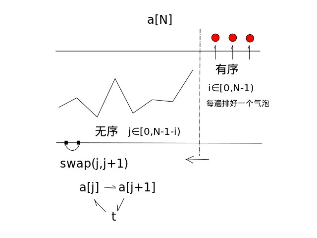
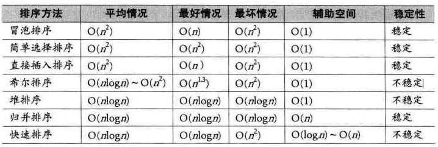

# 排序算法

## 归并排序

```cpp
#include<iostream>
#include<vector>
using namespace std;

void merge(vector<int>& nums, int start, int mid, int end) {
    vector<int> res(end - start + 1);
    int i = start;
    int j = mid + 1;
    int k = 0;
    while (i <= mid && j <= end) {
        if (nums[i] <= nums[j])
            res[k++] = nums[i++];
        else
            res[k++] = nums[j++];
    }

    while (i <= mid) res[k++] = nums[i++];
    while (j <= end) res[k++] = nums[j++];

    for (int i = 0; i < k; ++i)
        nums[start + i] = res[i];
}

void mergesort(vector<int>& nums, int start, int end) {
    if (start < end) {
        int mid = start + (end - start) / 2;
        mergesort(nums, start, mid);
        mergesort(nums,  mid + 1, end);
        merge(nums, start, mid, end);
    }
}
```

-----

## 快速排序

一篇很好的博文：[白话经典算法系列之六 快速排序 快速搞定](https://blog.csdn.net/MoreWindows/article/details/6684558)。

另外一篇 <http://www.cnblogs.com/ayqy/p/3862938.html>.

快速排序算法的优点，为什么称之为快排？

Quicksort是对归并排序算法的优化，继承了归并排序的优点，同样应用了分治思想。

所谓的分治思想就是对一个问题“分而治之”，用分治思想来解决问题需要两个步骤：

1. 如何“分”？（如何缩小问题的规模）

2. 如何“治”？（如何解决子问题）

快排的前身是归并，而正是因为归并存在不可忽视的缺点，才产生了快排。归并的最大问题是需要额外的存储空间，并且由于合并过程不确定，致使每个元素在序列中的最终位置上不可预知的。针对这一点，快速排序提出了新的思路：把更多的时间用在“分”上，而把较少的时间用在“治”上。从而解决了额外存储空间的问题，并提升了算法效率。

```cpp
#include<iostream>
#include<vector>
#include<algorithm>
using namespace std;

//返回pivot应该在的位置
int partition(vector<int>& nums, int l, int r) {
    int pivot = nums[l];
    while (l < r) {
        while (l < r && nums[r] > pivot)
            --r;
        if (l < r)
            nums[l++] = nums[r];

        while (l < r && nums[l] <= pivot)
            ++l;
        if (l < r)
            nums[r--] = nums[l];
    }
    nums[l] = pivot;
    return  l;
}

void quick_sort(vector<int>& nums, int low, int high) {
    if (low < high) {
        int pivot = partition(nums, low, high);
        quick_sort(nums, low, pivot - 1);
        quick_sort(nums, pivot + 1, high);
    }
}
```

-----

## 冒泡排序

冒泡排序演算法的運作如下：

1. 比較相鄰的元素。如果第一個比第二個大，就交換他們兩個。
2. 對每一對相鄰元素作同樣的工作，從開始第一對到結尾的最後一對。這步做完後，最後的元素會是最大的數。
3. 針對所有的元素重複以上的步驟，除了最後一個。
4. 持續每次對越來越少的元素重複上面的步驟，直到沒有任何一對數字需要比較。



```cpp
void bubble_sort(vector<int>& nums){
    for(int i = 0; i < n; ++i){
        for(int j = 0; j < n-1-i; ++j){
            if(nums[j] > nums[j+1])
                swap(nums[j], nums[j+1]);
        }
    }
}
```


```cpp
void bubble_sort(vector<int>& nums) {
    int n = nums.size();
    for (int i = 0; i < n; ++i)
        //注意是从后往前
        for (int j = n - 1; j > i; --j)
            if (nums[i] > nums[j])
                swap(nums[i], nums[j]);
}
```

-----

## 堆排序

堆是一个近乎的完全二叉树。一般用一维数组来表示堆的结构。堆中子节点的值总是小于（大于）父节点的值。如果用`nums[i]`表示堆(`i`从0开始)，那么`nums[i]`有如下特性（参见[维基百科](https://zh.wikipedia.org/wiki/%E5%A0%86%E6%8E%92%E5%BA%8F)）：

1. 父节点`i`的左子节点在`2*i+1`位置；
2. 父节点`i`的右子节点在`2*i+2`位置；
3. 子节点`i`的父节点在`floor((i-1)/2)`。

堆排序的原理包括两部分：

- 首先将数组`nums[0...n]`构造成大顶堆，此时`nums[0]`为整个数组`nums[0...n]`中的最大值；
- 将`nums[0]`移动到数组`nums[0...n]`末尾， 数组长度减一，循环对子串`nums[0,...,n-1]`执行这两个步骤，直到子串的长度为1，排序结束。

```cpp
#include<iostream>
#include<vector>
#include<algorithm>
using namespace std;

void max_heapify(vector<int>& nums, int start, int end){
    int dad = start;
    int son = start * 2 + 1;
    while(son <= end){
        // 选择出父节点的两个子节点的较大值
        if(son + 1 <= end && nums[son] < nums[son + 1])
            son = son + 1;
        // 如果父节点的值已经比两个子节点的值大，满足大顶堆的条件，直接返回
        if(nums[dad] > nums[son])
            return;
        else{
            swap(nums[dad], nums[son]);  // 否則交換父子內容再繼續子節點和孫節點比較
            dad = son;
            son = dad * 2 + 1;
        }
    }
}

void heap_sort(vector<int>& nums){
    int len = nums.size();

    // 将数组nums构造成一个大顶堆，从右到左，从下到上，对每一个非叶子节点的父节点进行调整。
    // 由性质3可知，最后一个叶子节点len-1的父节点为 floor((len-1-1)/2)
    for(int i = (len-1-1)/2; i >= 0; --i)
        max_heapify(nums, i, len-1);

    // 排序
    for(int i = len-1; i > 0; --i){
        swap(nums[0], nums[i]);
        max_heapify(nums, 0, i-1);
    }
}
```

-----

## 插入排序

对于数组`nums`，假设`nums[0..i-1]`已经是有序的，那么对于`nums[i]`，如果`nums[i] < nums[i-1]`，则将`nums[0...i-1]`由后往前的与`nums[i]`比较，直到找到`nums[k] >= nums[i]`，找到`nums[i]`应该在的位置。`nums[k+1...i-1]`整体右移一位，`nums[i]`插入到`nums[k+1]`的位置。

[维基百科上的解释](https://zh.wikipedia.org/wiki/%E6%8F%92%E5%85%A5%E6%8E%92%E5%BA%8F)：

一般来说，插入排序都采用in-place在数组上实现。具体算法描述如下：

1. 从第一个元素开始，该元素可以认为已经被排序
2. 取出下一个元素，在已经排序的元素序列中从后向前扫描
3. 如果该元素（已排序）大于新元素，将该元素移到下一位置
4. 重复步骤3，直到找到已排序的元素小于或者等于新元素的位置
5. 将新元素插入到该位置后
6. 重复步骤2~5

```cpp
#include<iostream>
#include<vector>
using namespace std;

void insert_sort(vector<int>& nums){
    int len = nums.size();
    for(int i = 1; i < len; ++i){
        int j = i;
        int tmp = nums[i];
        while(j-1 >= 0 && tmp < nums[j-1]){
            nums[j] = nums[j-1];
            --j;
        }
        nums[j] = tmp;
    }
}
```

-----

## 希尔排序

插入排序的改进版。对于一个新元素，插入排序是将该元素由后往前、步长为1的与之前的元素比较，直到找到合适的位置，存在移动次数多的问题，比如`nums[i]`排序后的位置应该是在`nums[i-5]`，插入排序需要移动5次，而希尔排序通过加大移动的步长能够移动的次数。希尔排序是将原数组按一定的步长分成不同的子数组，对子数组进行插入排序；再改变步长分组，插入排序..直到步长小于1。

[维基百科](https://zh.wikipedia.org/wiki/%E5%B8%8C%E5%B0%94%E6%8E%92%E5%BA%8F)

一个更好理解的希尔排序实现：将数组列在一个表中并对列排序（用插入排序）。重复这过程，不过每次用更长的列来进行。最后整个表就只有一列了。将数组转换至表是为了更好地理解这算法，算法本身仅仅对原数组进行排序（通过增加索引的步长，例如是用`i += step_size`而不是`i++`）。

例如，假设有这样一组数`[ 13 14 94 33 82 25 59 94 65 23 45 27 73 25 39 10 ]`，如果我们以步长为5开始进行排序，我们可以通过将这列表放在有5列的表中来更好地描述算法，这样他们就应该看起来是这样：

    13 14 94 33 82
    25 59 94 65 23
    45 27 73 25 39
    10

然后我们对每列进行排序：

    10 14 73 25 23
    13 27 94 33 39
    25 59 94 65 82
    45

將上述四行数字，依序接在一起时我们得到：`[ 10 14 73 25 23 13 27 94 33 39 25 59 94 65 82 45 ]`.这时10已经移至正确位置了，然后再以3为步长进行排序：

    10 14 73
    25 23 13
    27 94 33
    39 25 59
    94 65 82
    45

排序之后变为：

    10 14 13
    25 23 33
    27 25 59
    39 65 73
    45 94 82
    94

最后以1步长进行排序（此时就是简单的插入排序了）。

```cpp
#include<iostream>
#include<vector>
#include<algorithm>
using namespace std;

void shell_sort(vector<int>& nums){
    int len = nums.size();
    int h = 1;
    while(h < len / 3)
        h = h * 3 + 1;

    while(h >= 1){
        for(int i = h; i < len; ++i){
            for(int j = i; j >= h && nums[j] < nums[j-h]; j -= h)
                swap(nums[j], nums[j-h]);
        }
        h /= 3;
    }
}
```


