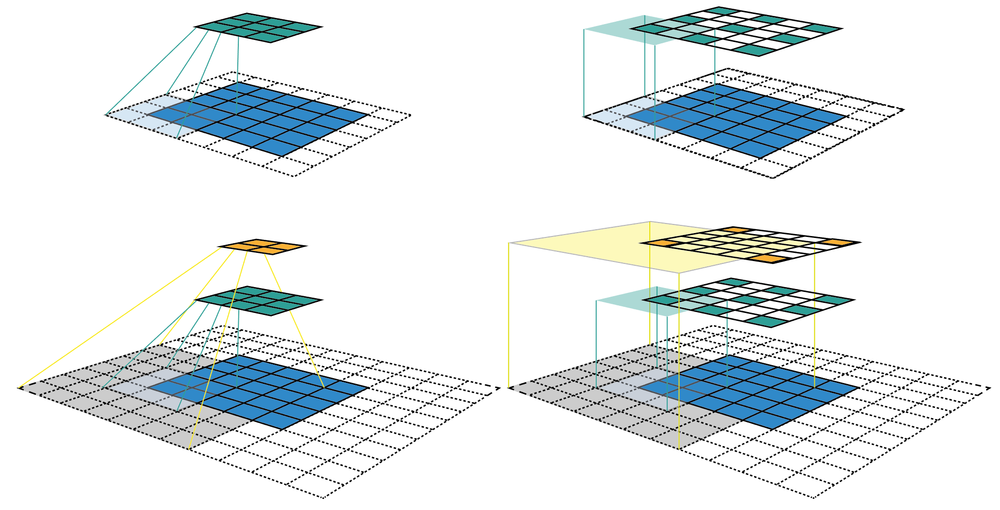
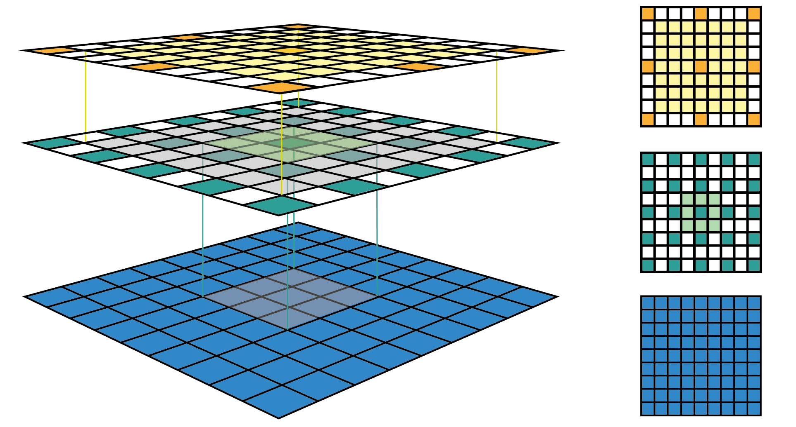
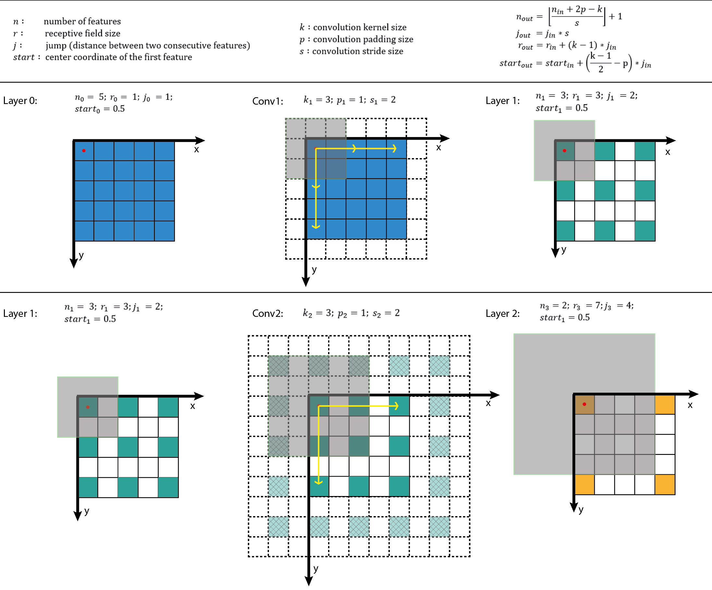
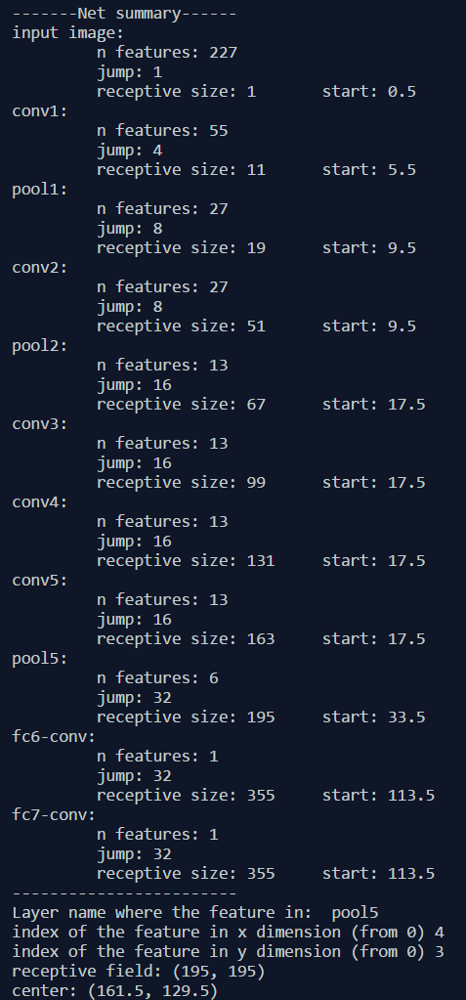

# [A guide to receptive field arithmetic for Convolutional Neural Networks](https://medium.com/mlreview/a-guide-to-receptive-field-arithmetic-for-convolutional-neural-networks-e0f514068807)

The ***receptive field\*** is perhaps one of the most important concepts in Convolutional Neural  Networks (CNNs) that deserves more attention from the literature. All of the state-of-the-art object recognition methods design their model  architectures around this idea. However, to my best knowledge, currently there is no complete guide on how to calculate and visualize the  receptive field information of a CNN. This post fills in the gap by  introducing a new way to visualize feature maps in a CNN that exposes  the receptive field information, accompanied by a complete receptive  field calculation that can be used for any CNN architecture. I’ve also  implemented a simple program to demonstrate the calculation so that  anyone can start computing the receptive field and gain better knowledge about the CNN architecture that they are working with.

To follow this post, I assume that you are familiar with the CNN concept, especially the convolutional and pooling operations. You can refresh  your CNN knowledge by going through the paper “[A guide to convolution arithmetic for deep learning](https://arxiv.org/pdf/1603.07285.pdf) [1]”. It will not take you more than half an hour if you have some  prior knowledge about CNNs. This post is in fact inspired by that paper  and uses similar notations.

> Note: If you want to learn more about how CNNs can be used for Object Recognition, [this post](https://medium.com/@nikasa1889/the-modern-history-of-object-recognition-infographic-aea18517c318) is for you.

# The fixed-sized CNN feature map visualization

*The* ***receptive field\*** *is defined as the region in the input space that a particular CNN’s feature is looking at (i.e. be affected by)*. A receptive field of a feature can be described by its **center location** and its **size**. **(Edit later)** However, not all pixels in a receptive field is equally important to  its corresponding CNN’s feature. Within a receptive field, the closer a  pixel to the center of the field, the more it contributes to the  calculation of the output feature. Which means that a feature does not  only look at a particular region (i.e. its receptive field) in the input image, but also focus exponentially more to the middle of that region.  This important insight will be explained further in another blog post.  For now, we focus on calculating the location and size of a particular  receptive field.

Figure 1 shows some receptive field examples. By applying a convolution C with kernel size ***k =\* 3x3**, padding size ***p =\* 1x1**, stride ***s =\* 2x2** on an input map **5x5**, we will get an output feature map **3x3** (green map). Applying the same convolution on top of the 3x3 feature map, we will get a **2x2** feature map (orange map). The number of output features in each  dimension can be calculated using the following formula, which is  explained in detail in [[1](https://arxiv.org/pdf/1603.07285.pdf)].

Note that in this post, to simplify things, I assume the CNN architecture to be symmetric, and the input image to be square. So both dimensions have the same values for all variables. If the CNN architecture or the input image is asymmetric, you can calculate the feature map attributes  separately for each dimension.

Figure 1: Two ways to visualize CNN feature maps. In all cases, we uses the  convolution C with kernel size k = 3x3, padding size p = 1x1, stride s = 2x2. (Top row) Applying the convolution on a 5x5 input map to produce  the 3x3 green feature map. (Bottom row) Applying the same convolution on top of the green feature map to produce the 2x2 orange feature map.  (Left column) The common way to visualize a CNN feature map. Only  looking at the feature map, we do not know where a feature is looking at (the center location of its receptive field) and how big is that region (its receptive field size). It will be impossible to keep track of the  receptive field information in a deep CNN. (Right column) The  fixed-sized CNN feature map visualization, where the size of each  feature map is fixed, and the feature is located at the center of its  receptive field.

The left column of Figure 1 shows a common way to visualize a CNN feature  map. In that visualization, although by looking at a feature map, we  know how many features it contains. It is impossible to know where each  feature is looking at (the center location of its receptive field) and  how big is that region (its receptive field size). The right column of  Figure 1 shows the fixed-sized CNN visualization, which solves the  problem by keeping the size of all feature maps constant and equal to  the input map. Each feature is then marked at the center of its  receptive field location. Because all features in a feature map have the same receptive field size, we can simply draw a bounding box around one feature to represent its receptive field size. We don’t have to map  this bounding box all the way down to the input layer since the feature  map is already represented in the same size of the input layer. Figure 2 shows another example using the same convolution but applied on a  bigger input map — 7x7. We can either plot the fixed-sized CNN feature  maps in 3D (Left) or in 2D (Right). Notice that the size of the  receptive field in Figure 2 escalates very quickly to the point that the receptive field of the center feature of the second feature layer  covers almost the whole input map. This is an important insight which  was used to improve the design of a deep CNN.

Figure 2: Another fixed-sized CNN feature map representation. The same  convolution C is applied on a bigger input map with i = 7x7. I drew the  receptive field bounding box around the center feature and removed the  padding grid for a clearer view. The fixed-sized CNN feature map can be  presented in 3D (Left) or 2D (Right).

# Receptive Field Arithmetic

To calculate the receptive field in each layer, besides the number of features ***n\*** in each dimension, we need to keep track of some extra information for  each layer. These include the current receptive field size ***r , \*** the distance between two adjacent features (or jump) ***j, \*** and the center coordinate of the upper left feature (the first feature) ***start\***. Note that the center coordinate of a feature is defined to be the  center coordinate of its receptive field, as shown in the fixed-sized  CNN feature map above. When applying a convolution with the kernel size ***k\***, the padding size ***p\***, and the stride size ***s\***, the attributes of the output layer can be calculated by the following equations:

* The **first equation** calculates the ***number of output features\*** based on the number of input features and the convolution properties. This is the same equation presented in [[1](https://arxiv.org/pdf/1603.07285.pdf)].
* The **second equation** calculates the ***jump\*** in the output feature map, which is equal to the *jump in the input map* times *the number of input features that you jump over* when applying the convolution (the stride size).
* The **third equation** calculates the ***receptive field size\*** of the output feature map, which is equal to the area that covered by ***k\*** input features ***(k-1)\*j_in\*** plus the extra area that covered by the receptive field of the input feature that on the border.
* The **fourth equation** calculates the ***center position\*** of the receptive field of the first output feature, which is equal to the *center position of the first input feature* plus *the distance from the location of the first input feature to the center of the first convolution* ***(k-1)/2\*j_in\*** minus *the padding space* ***p\*j_in.\*** Note that we need to multiply with the jump of the input feature map in both cases to get the actual distance/space.

The first layer is the input layer, which always has ***n = image size\***, ***r = 1\***, ***j = 1\***, and ***start = 0.5.\*** Note that in Figure 3, I used the coordinate system in which the center of  the first feature of the input layer is at 0.5. By applying the four  above equations recursively, we can calculate the receptive field  information for all feature maps in a CNN. Figure 3 shows an example of  how these equations work.

Figure 3: Applying the receptive field calculation on the example given in  Figure 1. The first row shows the notations and general equations, while the second and the last row shows the process of applying it to  calculate the receptive field of the output layer given the input layer  information.

I’ve also created a small python program that calculates the receptive field information for all layers in a given CNN architecture. It also allows  you to input the name of any feature map and the index of a feature in  that map, and returns the size and location of the corresponding  receptive field. The following figure shows an output example when we  use the AlexNet. The code is provided at the end of this post.

