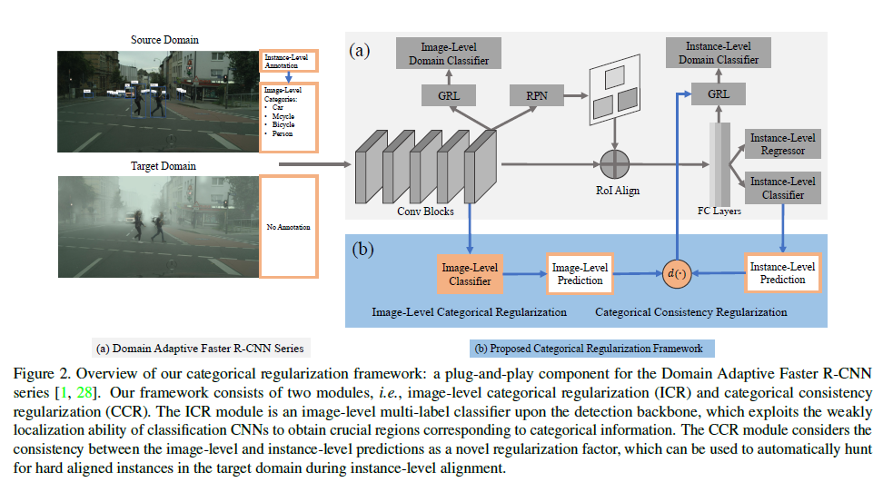

《Exploring Categorical Regularization for Domain Adaptive Object Detection》

<https://arxiv.org/pdf/2003.09152.pdf>



提出类别正则化框架，主要使用**多标签分类**来实现前景物体的弱监督。

> It is widely acknowledged that CNNs trained for singlelabel image classification tend to produce high responses on the local regions containing the main objects [38, 40, 39]. Analogously, CNNs trained for multi-label classification also have the weakly localization ability for the objects associated with image-level categories [35, 36].

并将图像级（Image Level）的多标签结果与实例级（Instance Level）的预测结果进行监督，挖掘目标域实例中的难样本（对实例赋予不同的损失权重）。

[source code](https://github.com/Megvii-Nanjing/CR-DA-DET/blob/5a6ebbecef6e516fa9944573afc29fb554b02f85/DA_Faster_ICR_CCR/lib/model/da_faster_rcnn_instance_weight/faster_rcnn.py#L267)

``` python
target_weight = []
for i in range(len(tgt_pre_label)):
    label_i = tgt_pre_label[i].item()
    if label_i > 0:
        diff_value = torch.exp(
            weight_value
            * torch.abs(tgt_image_cls_feat[label_i - 1] - tgt_prob[i][label_i])
        ).item()
        target_weight.append(diff_value)
    else:
        target_weight.append(1.0)

tgt_instance_loss = nn.BCELoss(
    weight=torch.Tensor(target_weight).view(-1, 1).cuda()
)
```
